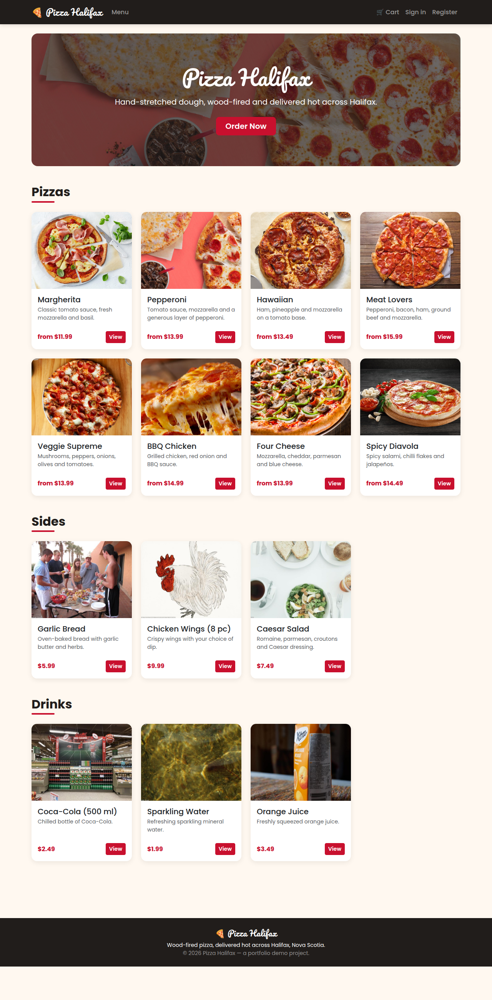
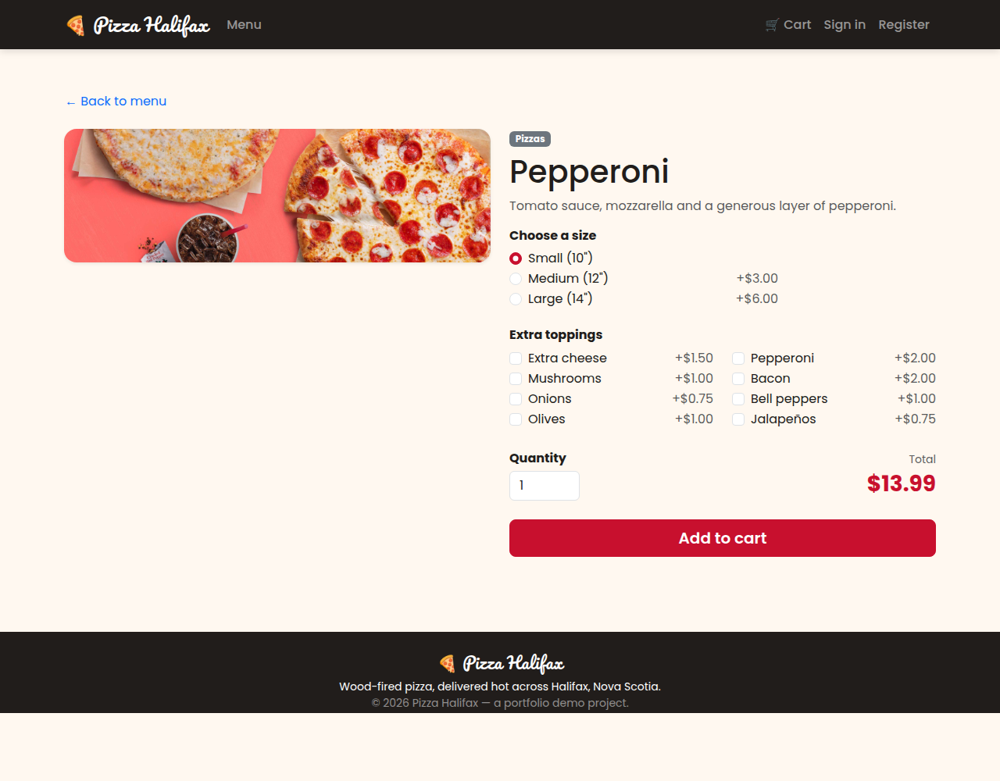

# 🍕 Pizza Halifax

A full-stack **e-commerce web application** for a fictional pizza restaurant in
Halifax, Nova Scotia. Customers can browse the menu, customize pizzas, manage a
cart and place orders; staff manage the menu and orders through a role-protected
admin panel.

Built as a portfolio project with **ASP.NET Core MVC**, **Entity Framework Core**
and **PostgreSQL**.

**🌐 Live demo:** https://pizza-halifax-8vsf0.azurewebsites.net
&nbsp;·&nbsp; Admin login: `admin@pizzahalifax.local` / `Admin123!`
_(hosted on Azure App Service + Azure Database for PostgreSQL)_



## Features

**Storefront (customers)**
- Menu grouped by category with real product photos
- Pizza customization — choose a size and extra toppings with a live price total
- Session-based shopping cart (add, remove, clear) with a navbar item counter
- Checkout with delivery details and a simulated payment step
- Free delivery over $25, otherwise a flat delivery fee
- Account registration / login and personal order history

**Admin panel** (`/Admin`, restricted to the `Admin` role)
- Dashboard with product count, order count and total revenue
- Full menu CRUD — create, edit and delete products
- View all orders and update their status (Pending → Confirmed → Preparing → …)



## Tech stack

| Area | Technology |
|------|-----------|
| Framework | ASP.NET Core MVC (.NET 10) |
| Data | Entity Framework Core + PostgreSQL (Npgsql) |
| Auth | ASP.NET Core Identity (cookie auth, roles) |
| UI | Bootstrap 5, custom CSS, Razor views |

## Getting started

### Prerequisites
- [.NET 10 SDK](https://dotnet.microsoft.com/download)
- PostgreSQL — either a local install **or** Docker
- EF Core tools: `dotnet tool install --global dotnet-ef`

### 1. Get the database running

**Option A — Docker (no Postgres install needed):**
```bash
docker compose up -d
```

**Option B — existing local PostgreSQL:**
```bash
sudo -u postgres psql \
  -c "CREATE ROLE pizza_user LOGIN PASSWORD 'pizza_dev_pass';" \
  -c "CREATE DATABASE halifax_pizza OWNER pizza_user;"
```

Both options match the default connection string in
[`appsettings.json`](appsettings.json). To use different credentials, edit the
`DefaultConnection` string there.

### 2. Apply migrations

```bash
dotnet ef database update
```

This creates the schema and seeds the menu (pizzas, sides, drinks, sizes,
toppings). The default admin account and roles are seeded automatically on
first run.

### 3. Run the app

```bash
dotnet run
```

Then open the URL shown in the console (e.g. `http://localhost:5204`).

### Default admin login

| Email | Password |
|-------|----------|
| `admin@pizzahalifax.local` | `Admin123!` |

Sign in with these to access the **Admin** link in the navbar.

## Project structure

```
Controllers/        MVC controllers (Home, Products, Cart, Checkout, Account, Orders, Admin)
Models/             Domain entities (Product, Order, OrderItem, Category, ...)
ViewModels/         Form/page view models
Data/               DbContext, ApplicationUser, seed data
Services/           CartService (session-backed cart)
Views/              Razor views
wwwroot/            Static assets (CSS, JS, product images)
docs/screenshots/   README images
```

## Notes
- **Payment is simulated** — no real gateway is integrated; orders are recorded
  as `Confirmed` at checkout.
- **Product images** are free-licensed stock photos used for the demo. Replace
  the files in `wwwroot/images/menu/` (keeping the same names) to use your own.
- The app pins its culture to `en-US` so prices parse and display consistently
  regardless of the host machine's locale.

## Author
A personal pet / portfolio project by **Ruslan Kuchynskyi**
([@Ruslan0010](https://github.com/Ruslan0010)), built to demonstrate full-stack
ASP.NET Core development.

## License
MIT — free to use as a learning/portfolio reference.
